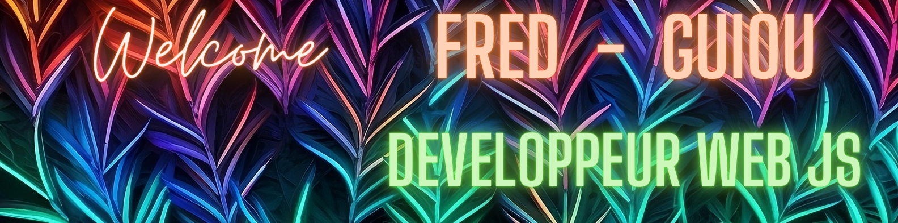

 

Hi everyone !👋🏼 I'm Fred ! I live in south of France around Marseille and Aix en Provence in a city called Auriol.  
Passionate about computers, new technologies, cinema, tv shows and... my cat 😅,
I like sharing with people all about this ! 🚀 
In 2021, I chose to change my professional life and become a fullstack <strong>developper</strong> to provide digital solutions to problems encountered by everyone. 
During this journey, I discovered incredible guys & girls. 
Here is all I practiced from feb 2022 to now ! 💪🏼

## Past, Present, Future... 🔮

🟣 Previously,  I was an accountant for seventeen years, during which time I developed my professional skills, both technical and human.  
🟢Since 2022 and until today,  I have done everything possible to allow me to improve my skills in web development, thanks to intense training and the preparation of the defense of my professional title DWWM in front of a jury of two senior professionals. I also continued to practice while looking for a position in this universe that I like so much.  
🟠 Soon,  I want to join a dynamic team that will make me participate in the development of captivating projects that will provide solutions to user requests.

📡 You can contact me here ! 📡

  
  
  

## Here are all my skills 🤩🤖👨🏻‍💻

|🤖BACKEND|🎨FRONTEND|🔧DATABASE|🎛️ARCHITECTURE|🔎VERSIONING|
|--|--|--|--|--|
|nodeJS|HTML/CSS|SQL|Model Views Controllers (MVC)|Git / GitHub
|Express Framework|JAVASCRIPT Vanilla|PostgreSQL - PgAdmin|API REST|SQITCH on Windows
|Session & cookies|SASS (en cours)|Procedural Laguage // Functions - Views - Indexes|API GraphQL||
|Authorization Json Web Token|React|NoSQL|||
|DataMapper (queries) / Active Record (models)||MongoDB|||
|ORM - Sequelize|||||
|Security encrypt datas Bcrypt - Joi|||||
|EJS Views|||||

|🔬METHODS|🖍️CMS|🖥️PROGRAMING|🚀DEPLOYMENT|👨🏻‍💻DEVOPS|📄DOCUMENTATION|
|--|--|--|--|--|--|
|Agile (Scrum)|Strapi (introduction)|OOP (Object Oriented Programming)|Heroku (concept & methods)|Docker (notions)|JSdocs // SwaggerDocs (concept & how to do)|
|Merise (CMD, GPM, PDM)||||||

## Here are all my stats 🔬🧪❇️

 

 

 

In the "Pinned" category below you will find six works that offer insight into my technical skills. I also invite you to consult TP-DWWM-2022 in which you will find my professional title files presenting in particular the "Sonow" project, the entire code of which is also accessible to you.

 

Enjoy ! 😎

Sources :

* [Badges](https://shields.io/category/build)
* [1st contribution for stats](https://github.com/DenverCoder1/github-readme-streak-stats)
* [2nd contribution for stats](https://github.com/anuraghazra/github-readme-stats#github-stats-card)

Thanks to Yumicode, Zarwine & Megafredo for their design opinions 😊
